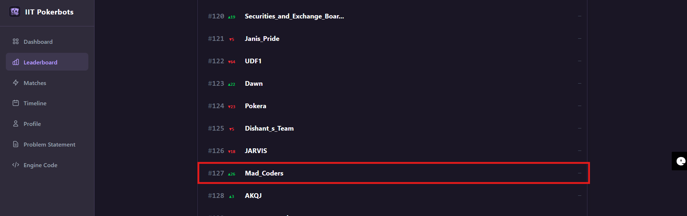
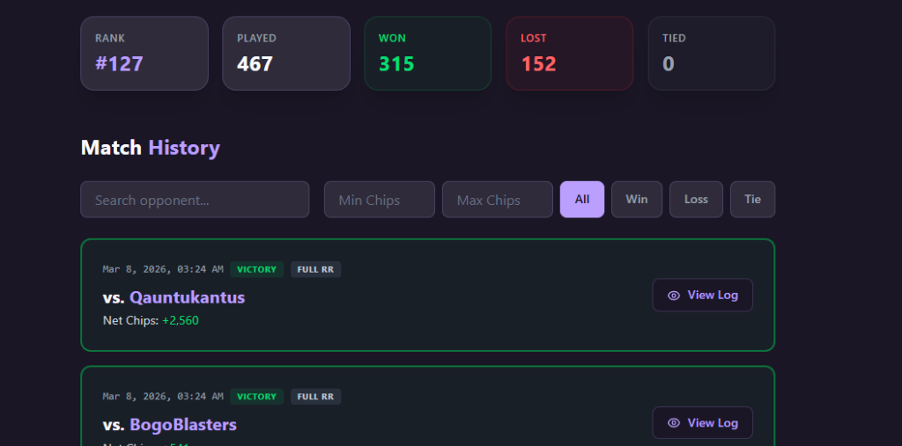

# Mad Coders — Sneak Peek Hold'em Poker Bot

> IIT Pokerbots 2026 Competition | **Rank #127** | **67.5% Win Rate**

An autonomous poker bot built for the [IIT Pokerbots 2026](https://www.iitpokerbots.com/) competition, playing a custom variant called **Sneak Peek Hold'em** — a heads-up No-Limit Texas Hold'em variant with a unique **Vickrey auction** mechanic that allows players to bid for a peek at one of their opponent's hole cards.
The link for the original bot engine repository is [IIT Pokerbots 2026 bot engine](https://github.com/iitpokerbots/bot-engine-2026)

We achieved the **127th rank** among 461 teams in the competition. We did not qualify for the next round, but here is our attempt at it. Hopefully, we will do better next year!

<p align="center">
  
</p>

<p align="center">
  
</p>

<p align="center">
  
</p>


---

## Competition Results

| Metric | Value |
|:---|:---|
| **Final Rank** | #127 |
| **Matches Played** | 467 |
| **Wins** | 315 |
| **Losses** | 152 |
| **Win Rate** | 67.5% |

---

## Game Rules — Sneak Peek Hold'em

| Parameter | Value |
|:---|:---|
| Format | Heads-up (1v1) |
| Rounds per match | 1,000 |
| Starting stack | 5,000 chips |
| Blinds | 10 / 20 |
| Streets | Pre-flop → Flop → **Auction** → Turn → River |

### The Auction
After the flop, both players submit sealed bids. The **highest bidder** wins and gets to see **one random card** from their opponent's hand. The winner pays the **loser's bid** (Vickrey / second-price auction), making truthful bidding the dominant strategy.

---

## Bot Architecture

```
┌─────────────────────────────────────────────────┐
│                  Player Bot                      │
├─────────┬───────────┬───────────┬───────────────┤
│ Pre-flop│  Auction   │Post-flop  │  Opponent     │
│  Chen   │  Vickrey   │  Monte    │   Modeling    │
│ Formula │  Bidding   │  Carlo    │  (fold rate)  │
├─────────┴───────────┴───────────┴───────────────┤
│              eval7 C Extension                   │
│         (~100x faster hand evaluation)           │
└─────────────────────────────────────────────────┘
```

### Key Components

- **Monte Carlo Equity Estimation** — Runs 200–2,500 simulations per decision using [eval7](https://github.com/julianandrews/pyeval7)'s C extension for hand evaluation. Simulation count adapts dynamically based on remaining time bank.

- **Modified Chen Formula** — Pre-flop hand ranking that maps 169 starting hand categories to a strength score in [0.20, 0.90], avoiding the Monte Carlo clustering problem where all pre-flop hands converge to ~0.50.

- **Vickrey-Optimal Auction Bidding** — Bids based on information value (hand uncertainty × pot leverage), capped at 10% of stack to avoid auction traps.

- **Adaptive Opponent Modeling** — Tracks opponent fold frequency across the match to calibrate bluff frequency and identify maniacs vs. tight players.

- **Board Texture Awareness** — Detects paired boards and avoids re-raising without trips, preventing common trap losses.

- **Position-Aware Play** — Adjusts hand strength ±3% based on positional advantage (in-position vs. out-of-position).

---

##  Quick Start

### Prerequisites

- Python 3.8+

### Setup

```bash
git clone https://github.com/<your-username>/pokerbots-2026.git
cd pokerbots-2026
pip install -r requirements.txt
```

### Run a Test Match

```bash
# Edit config.py to set bot matchups
python engine.py
```

Logs are saved to `logs/` after each match.

### Configuration

Edit `config.py` to configure which bots play:

```python
BOT_1_NAME = 'MadCoders'
BOT_1_FILE = './bot.py'

BOT_2_NAME = 'Opponent'
BOT_2_FILE = './bot.py'   # or another bot file
```

---

## Project Structure

```
.
├── bot.py              # Bot implementation (core strategy)
├── engine.py           # Game engine (do not modify)
├── config.py           # Match configuration
├── requirements.txt    # Python dependencies (eval7)
├── pkbot/              # Engine support package
│   ├── actions.py      # Action definitions (Fold, Call, Check, Raise, Bid)
│   ├── base.py         # BaseBot abstract class
│   ├── runner.py       # Bot process runner
│   └── states.py       # GameInfo & PokerState definitions
└── assets/             # Documentation assets
    └── competition_results.png
    └──leaderboard_position.png
```

---

## Technical Details

### Time Management

The bot has a **30-second total time bank** for all 1,000 rounds. The adaptive simulation system ensures:

| Time per round | Simulations |
|:---|:---|
| < 8ms | 200 |
| < 15ms | 500 |
| < 30ms | 1,000 |
| ≥ 30ms | 2,500 |

### Dependencies

| Package | Version | Purpose |
|:---|:---|:---|
| `eval7` | 0.1.10 | C-optimized poker hand evaluation |
| `future` | 1.0.0 | Python 2/3 compatibility |
| `pyparsing` | 3.3.2 | Parsing support |

---

## License

This project was developed for the IIT Pokerbots 2026 competition. The game engine (`engine.py`, `pkbot/`) is provided by the competition organizers.

---

<p align="center">
  Built by <strong>Mad_Coders</strong>
</p>
